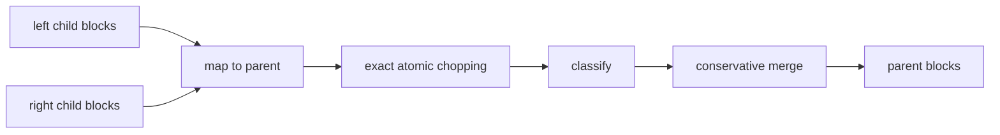

# hal-multisynteny

`hal-multisynteny` is an early-stage, ancestry-aware toolkit for constructing a
shared multi-genome synteny-block alphabet from Cactus/HAL homology mappings.
It is intended for rearrangement phylogeny and comparative-genomics research in
which pairwise blocks are insufficient.

> **Status:** research prototype. Version 0.2.0 adds deterministic reconciliation
> of two child block systems at one parent node. It does **not yet traverse an
> entire HAL file directly** and should not be described as a finished replacement
> for MAF2Synteny.

## Algorithm

The input is a run-length table mapping collinear intervals in descendant
genomes to one chosen ancestral genome in HAL. The builder:

1. groups runs by ancestral chromosome;
2. partitions each chromosome at observed run boundaries;
3. finds the descendant runs covering each atomic ancestral interval;
4. retains intervals meeting minimum length and species-support thresholds;
5. projects each retained interval back into every descendant occurrence;
6. preserves reverse orientation, duplicated copies, and mapping status.

This produces a common block ID for occurrences homologous through the chosen
ancestor. It is reference-free with respect to extant genomes, but it depends
on the selected HAL ancestor and on the quality and completeness of the input
runs.

The baseline is deliberately conservative: it does not yet merge adjacent
atomic blocks, infer missing mappings, or distinguish biological absence from
alignment failure.

## Bottom-up node reconciliation

The `reconcile-node` command is the node operation intended for a later binary
guide-tree runner. Both inputs must already be mapped to the named parent; this
command never executes `halSynteny`, `halLiftover`, or MAF2Synteny.



For each parent chromosome, the implementation sorts boundary events and sweeps
them once. It partitions at the union of input boundaries, classifies every
covered atom, filters atoms below the requested length, and then considers
neighboring retained atoms for merging. Exact chopping is authoritative and is
never changed by boundary tolerance.

An atom can be:

| Classification | Meaning |
|---|---|
| `shared_consistent` | Both children provide usable support with compatible orientation and no unresolved copy conflict. Child block labels need not match. |
| `left_only` / `right_only` | Only that child has usable mapped support. This is missing evidence on the other side, not confirmed biological absence. |
| `orientation_conflict` | Both sides support the interval but their parent-relative orientations disagree. |
| `order_conflict` | A child occurrence changes parent or descendant chromosome, orientation, or monotonic order across its runs. |
| `duplication_conflict` | Multiple candidates cannot be paired uniquely by copy identity. |
| `ambiguous` | An input mapping is explicitly ambiguous. |
| `unaligned` | A side is explicitly unaligned or has no usable mapping evidence. `unmapped` is accepted on input and normalized to this value. |
| `complex` | More than one conflict condition applies. |

`left_only`, `right_only`, `ambiguous`, and `unaligned` must not be interpreted
as biological absence. Establishing absence requires independent evidence.
Missing mappings, including missing species coverage for a copy family, are
missing evidence, not confirmed deletions or copy conflicts. Usable evidence
mixed with ambiguous or unaligned alternatives is classified conservatively as
`complex` so that uncertainty is not collapsed into a simpler label.

Internal child block systems normally contain multiple descendant taxa. Multiple
records from different species are species support, not duplication. The
reconciler detects duplicate candidates within a biological track grouped by
child node, species, child block, child occurrence, and copy ID. Multiple source
anchors or collinear fragments for the same grouped occurrence are retained as
fragments of one occurrence. A species is treated as multi-copy when it has
multiple active occurrence identities, multiple active copy IDs, repeated
occurrences for the same copy ID, or records explicitly marked `duplicated`.

Duplicated alternatives are retained with their copy IDs; the reconciler never
picks one paralog silently. Copy IDs are local to each child block system by
default (`--copy-id-scope local`), so matching labels such as `1` and `2` in two
children do not establish cross-child orthology and remain
`duplication_conflict` when they label alternatives. Under local scope, one
unique occurrence per species is ordinary support, even when several species in
the child system use copy label `1`.

Use `--copy-id-scope global` only when the input producer guarantees comparable
copy-family labels across child systems. Under `global`, the same copy-family
label may appear in many species; repeated use by species A, B, and C means
those species carry evidence for the same family, not three duplicate copies.
Duplicated candidates can resolve only when no species has more than one active
occurrence assigned to the same global family, the side-level active copy-family
sets match, and orientation/order checks are compatible. The current policy is
conservative: it does not infer orthology when global labels are incomplete,
contradictory, or absent, and it does not require every species to carry every
family.

Filtered atoms containing evidence are hard block boundaries. A retained atom on
one side of a below-threshold interval never merges with a retained atom on the
other side, regardless of `--max-merge-gap`, boundary tolerance, or matching
membership. The filtered atom remains in `atomic_intervals.tsv` with
`disposition=filtered`, `merge_reason=below_min_block_length`, and an empty
`final_parent_block_id`.

Adjacent retained atoms merge only when the chromosome, classification, child evidence,
orientation, copy relationship, and descendant projections are compatible.
Exact membership can merge across a gap no larger than `--max-merge-gap`.
`--boundary-tolerance` additionally permits a short boundary atom to join a
neighbor when each descendant track has a unique, directly adjacent, monotonic
continuation. It cannot cross a classification, orientation, order, copy, or
chromosome change. The atomic table keeps every original cut and records the
merge decision.

For a binary tree with `n` leaves, a future runner would need to map across tree
edges, but this release only performs one parent node. For `r` runs on one
parent chromosome, boundary sorting costs `O(r log r)`. The sweep then
materializes and sorts active left/right membership for each emitted atomic
interval, so total runtime also depends on the sum of active-set sizes and on
output table size. Memory is proportional to that chromosome's runs, active
state, retained groups, and emitted records. Chromosomes are independent and
form a natural future sharding boundary. These properties and synthetic tests
do not establish VGP-scale performance.

## Installation

HAL command-line tools are not needed for the synthetic example or unit tests.
They will be needed by the planned HAL extraction layer.

```bash
git clone https://github.com/ytabatabaee/hal-multisynteny.git
cd hal-multisynteny
python -m venv .venv
source .venv/bin/activate
python -m pip install -e '.[test]'
```

## Input schema

The `build` command accepts a tab-separated alignment-run table:

| Column | Meaning |
|---|---|
| `anchor_id` | Stable identifier for the source mapping run |
| `species` | Descendant genome name used in HAL |
| `chrom` | Descendant sequence name |
| `start`, `end` | Zero-based, half-open descendant interval |
| `ancestor` | Common HAL ancestral genome |
| `anc_chrom` | Ancestral sequence name |
| `anc_start`, `anc_end` | Zero-based, half-open ancestral interval |
| `strand` | Descendant orientation relative to the ancestor: `+` or `-` |
| `status` | Optional: `unique`, `duplicated`, `ambiguous`, or `unmapped` |
| `copy_id` | Optional copy identifier; defaults to `1` |

Each row must currently be an ungapped, length-preserving mapping run. Split a
gapped liftover into such runs before running the builder.

### Parent-mapped reconciliation runs

`reconcile-node` accepts one TSV per child with these required columns:

```text
child_node  child_block_id  child_occurrence_id  species  chrom  start  end
parent_node  parent_chrom  parent_start  parent_end  strand  copy_id  status
source_anchor_id
```

Coordinates are zero-based and half-open. Runs must be nonempty,
length-preserving, and collinear; split gapped mappings before reconciliation.
Statuses are `unique`, `duplicated`, `ambiguous`, and `unaligned`. The legacy
spelling `unmapped` is normalized to `unaligned`.

## Quick start

```bash
hal-multisynteny validate --runs examples/alignment_runs.tsv

hal-multisynteny build \
  --runs examples/alignment_runs.tsv \
  --output-prefix example \
  --min-block-length 50 \
  --min-species 2
```

Validate and reconcile two child systems:

```bash
hal-multisynteny validate-runs \
  --runs examples/childA.to_parent.tsv \
  --parent-node avianAncestor

hal-multisynteny reconcile-node \
  --parent-node avianAncestor \
  --left-node childA \
  --left-runs examples/childA.to_parent.tsv \
  --right-node childB \
  --right-runs examples/childB.to_parent.tsv \
  --output-prefix node17 \
  --min-block-length 50 \
  --boundary-tolerance 1 \
  --max-merge-gap 0 \
  --copy-id-scope local \
  --guide-tree-id cactus-tree-sha256:example
```

This creates:

- `example.blocks.tsv`: one row per ancestral block;
- `example.occurrences.tsv`: descendant coordinates, orientation, copy, and
  status for every block occurrence;
- `example.summary.json`: parameters and record counts.

The occurrence table is intentionally compatible with the extended input
schema planned for `hal-site-evaluator`.

Reconciliation writes `blocks.tsv`, `occurrences.tsv`,
`atomic_intervals.tsv`, `provenance.tsv`, `conflicts.tsv`, and `summary.json`.
The occurrence table retains the evaluator-compatible columns plus child-side,
child-node, child-block, and child-occurrence provenance. Each occurrence's
ancestral coordinates describe the represented portion of the parent block, not
necessarily the full parent block; the `coverage` column is `full` or `partial`.
In `blocks.tsv`, `copy_count` is a compatibility column that counts distinct
species/occurrence/copy tracks represented in the block. It is not a count of
globally distinct biological copy families.
The summary records parameters, including copy-ID scope, child ordering,
guide-tree identifier, SHA-256 input checksums,
classification counts and coverage, mapping-status fractions, and output names.

## Scientific interpretation

A block in this prototype is a maximal **atomic interval under the observed
input boundaries**, not automatically a uniquely correct biological synteny
block. Block definitions depend on minimum length, taxon sampling, the chosen
ancestor, alignment fragmentation, duplication handling, and later chaining
rules.

Multi-species child systems are expected during bottom-up reconciliation. A
parent interval can be carried upward as `shared_consistent` when each species
has one active occurrence, even if each child contributes many species. That
classification means the observed child systems are compatible under the
declared copy-ID scope; it does not prove complete multi-species orthology for
unobserved taxa or unresolved duplications.

Therefore, comparisons with MAF2Synteny should report:

- ancestral homology overlap;
- one-to-one, split, merge, and complex relationships;
- species coverage;
- duplication and ambiguity rates;
- downstream adjacency and tree sensitivity.

Neither block system should be treated as unquestionable ground truth.

## Guide-tree bias and consistency experiment

Bottom-up reconciliation can depend on the guide tree because it determines
which block systems are combined first. The resulting parent blocks are not
guide-tree independent. To measure this effect:

1. Construct blocks with the Cactus guide tree.
2. Repeat with an alternative plausible tree.
3. Repeat with a deliberately perturbed tree.
4. Compare block correspondence with `hal-site-evaluator`.
5. Compare adjacency matrices and the resulting rearrangement trees.
6. Test whether each inferred tree is systematically closer to the guide tree
   used during construction.

Use `--guide-tree-id` for a stable identifier or checksum. This package does
not add a label-independent evaluator; `hal-site-evaluator` remains the place
for cross-run correspondence analysis.

Open questions about `halSynteny` query/target reversal, ancestor composition,
duplication, PSL information loss, and tiny fixture requirements are tracked in
[`docs/HALSYNTENY_CONSISTENCY.md`](docs/HALSYNTENY_CONSISTENCY.md).

## Roadmap

### 0.3: HAL extraction and tree runner

- batch extraction of ancestral mapping runs through HAL APIs;
- chromosome/ancestral-segment streaming;
- provenance including HAL genome names, commands, and checksums.
- bottom-up traversal over a binary guide tree with resumable node outputs.

### 0.4: block simplification research

- evaluate alternative merge and chaining rules against the transparent 0.2 baseline;
- consider a future MAF2Synteny adapter only when alignment blocks are available;
- distinguish missing alignment from inferred biological absence where the
  available evidence permits it.

### 0.5: VGP-scale execution

- bounded-memory chromosome or ancestor-segment processing;
- resumable shards and deterministic merging;
- pilot benchmarks on birds, mammals, and deep vertebrate subsets;
- direct integration tests with `hal-site-evaluator`.

## Testing

```bash
python -m pytest -q
python -m ruff check .
python -m build
```

The tests are synthetic and need no HAL installation. They cover shared and
one-sided blocks, boundary mismatches, splits and merges, inversions,
translocations, local/global copy-ID scope, ambiguity, unaligned evidence,
filtered-atom barriers, deterministic byte output, left/right exchange, occurrence
propagation, CLI failures, and legacy `build` behavior.

## License

MIT
